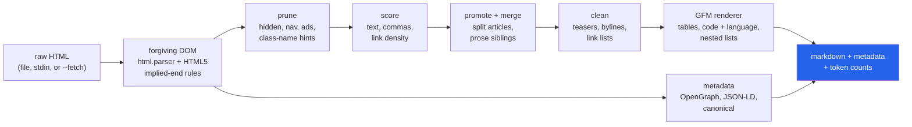

<h1 align="center">web-to-markdown (Python · html.parser · Markdown · zero dependencies)</h1>
<p align="center"><i>Web pages to agent-ready markdown with the standard library alone, measured on 3,975 hand-labelled pages, and on the structure that F1 never scores</i></p>

<p align="center">
  <a href="#the-through-line">The through-line</a> &middot;
  <a href="#findings">Findings</a> &middot;
  <a href="#input--output">Input / Output</a> &middot;
  <a href="#quick-start">Quick start</a> &middot;
  <a href="#what-this-does-not-do">What it does NOT do</a> &middot;
  <a href="#problems-hit-while-building-this">Problems hit</a>
</p>

<p align="center">
  
  
  
  
  <a href="LICENSE"></a>
</p>

Inspired by [firecrawl](https://github.com/mendableai/firecrawl) and
[crawl4ai](https://github.com/unclecode/crawl4ai); no code from either is used. The class-name
hint lists follow the patterns Mozilla's Readability made well known.

---

## The through-line



`web2md` is a library and CLI that turns a web page into the markdown an LLM agent should read:
the article, not the page. It has no runtime dependencies (the DOM is built on `html.parser`),
works offline on a file or stdin, and fetches over `urllib` only when asked.

The benchmark is the point. It scores eight systems on two public ground-truth benchmarks with
the published scoring rule, reproduces that rule's own numbers to three decimals, keeps a
held-out split for every tuning decision, and adds the axis the leaderboards leave out: whether
a table, code block or list is still a table, code block or list after extraction.

> **On the text-overlap metric, extraction is a solved-looking problem: four systems sit within
> 0.02 F1 of each other. Underneath that tie, the same systems deliver between 35% and 43% of
> the article's tables as tables, and between 45% and 98% of its code blocks as code. And the
> pages that "break every extractor" are mostly a labelling choice: on 420 Dragnet pages the
> ground truth includes the reader comments, which flips the ranking so that dumping the whole
> page beats every extractor.**

## Findings

Every number below is printed by `uv run python -m bench.summary` from the files in
[`results/`](results/). F1 is the shingle F1 of
[scrapinghub/article-extraction-benchmark](https://github.com/scrapinghub/article-extraction-benchmark)
(AEB); brackets are 95% bootstrap intervals over pages.

| | Finding | Evidence |
|---|---|---|
| **1** | **The metric port is exact.** Scoring AEB's own published outputs with `bench/metrics.py` gives trafilatura 0.9575, readability 0.9223 and html-text 0.6649 against published 0.958, 0.922 and 0.665. | [`metric_check.json`](results/metric_check.json) |
| **2** | **On AEB, web2md is level with the best.** 0.973 on the 101 held-out pages (never looked at while tuning) against trafilatura's 0.966; the paired difference, +0.007 [-0.002, +0.017], is not significant. It beats readability-lxml by +0.018 [+0.010, +0.026]. | [`extraction.json`](results/extraction.json), [`paired_diffs.json`](results/paired_diffs.json) |
| **3** | **The AEB tuning does not transfer as a lead.** On the 3,794 WCEB pages (7 datasets, all held out) web2md scores 0.883, readability-lxml 0.884 (difference -0.001, not significant) and trafilatura 0.873. Switching the whole clean stage off *raises* WCEB F1 to 0.888: rules learnt on 2019 news pages cost a little on 2007 web pages. | [`ablations.json`](results/ablations.json) |
| **4** | **F1 and structure disagree.** trafilatura's markdown keeps the text of 99% of gold code blocks but emits only 45% of them as code (the rest become paragraphs); web2md emits 86%, readability-lxml (rendered by web2md) 98%. Of gold tables, extractors keep 40-57% of the text but only 35-43% as a table. | [`structure.json`](results/structure.json) |
| **5** | **"Pages that break every extractor" are mostly a labelling choice.** 189 pages defeat web2md, trafilatura and readability-lxml alike (best F1 < 0.5); 127 of them are Dragnet pages whose truth still contains the reader comments. Rescored against the article alone, extractors on those 420 pages go from 0.63-0.67 to 0.89-0.92 and whole-page dumps fall from 0.74-0.77 to 0.43-0.45. | [`comments_convention.json`](results/comments_convention.json), [`failures.json`](results/failures.json) |
| **6** | **Extraction, not markdown, is where the tokens go.** Raw HTML costs a median 15,973 cl100k tokens per page. web2md's output is 94.4% smaller (1.06 tokens per article token); a whole-page converter (html2text, markdownify) saves only 64-65% and spends 5.6 tokens per article token. | [`tokens.json`](results/tokens.json) |

### F1 with 95% bootstrap CI

| system | AEB dev (80) | AEB held-out (101) | WCEB, 7 datasets (3,794) |
|---|---|---|---|
| web2md | 0.972 [0.963, 0.980] | 0.973 [0.965, 0.981] | 0.883 [0.877, 0.888] |
| trafilatura | 0.952 [0.935, 0.968] | 0.966 [0.954, 0.977] | 0.873 [0.868, 0.879] |
| trafilatura-md | 0.946 [0.929, 0.962] | 0.955 [0.941, 0.968] | 0.866 [0.861, 0.872] |
| readability-lxml | 0.948 [0.919, 0.969] | 0.956 [0.944, 0.967] | 0.884 [0.878, 0.890] |
| largest-block | 0.909 [0.881, 0.935] | 0.887 [0.840, 0.929] | 0.813 [0.804, 0.822] |
| all-text | 0.682 [0.639, 0.724] | 0.660 [0.619, 0.701] | 0.739 [0.732, 0.745] |
| html2text | 0.670 [0.627, 0.714] | 0.647 [0.607, 0.686] | 0.709 [0.702, 0.716] |
| markdownify | 0.673 [0.629, 0.716] | 0.653 [0.611, 0.693] | 0.720 [0.714, 0.727] |

`all-text` is web2md's renderer with extraction off (the recall ceiling); `largest-block` is the
one-rule heuristic "the parent of the most `<p>` text is the article". readability-lxml's HTML
is rendered by web2md so that row compares *extraction*; trafilatura (plain text, as in the
published benchmark) and trafilatura-md (its markdown output) use trafilatura's own renderer.

### WCEB, per dataset

| dataset | pages | web2md | trafilatura | readability-lxml | all-text |
|---|---|---|---|---|---|
| cetd | 700 | **0.912** | 0.911 | 0.911 | 0.787 |
| cleaneval | 731 | **0.895** | 0.870 | 0.887 | 0.879 |
| cleanportaleval | 69 | 0.948 | 0.948 | **0.959** | 0.597 |
| dragnet | 1379 | 0.837 | 0.834 | **0.847** | 0.654 |
| google-trends-2017 | 179 | 0.799 | **0.851** | 0.799 | 0.642 |
| l3s-gn1 | 621 | **0.931** | 0.897 | 0.926 | 0.685 |
| readability | 115 | 0.957 | 0.934 | **0.963** | 0.825 |

No system wins every dataset. On CleanEval, whose annotators kept most visible text, dumping
the whole page (0.879) beats trafilatura (0.870): the "right answer" depends on the dataset.

### Structure kept / text kept

A gold structure is a table, `<pre>` block, list or heading in the source HTML whose text is in
the ground-truth article. *Structure kept* means it reached the output as that markdown
construct (table rows, a fenced or indented block with its lines intact, list items, a heading
line); *text kept* means its words reached the output at all.

| system | table (n=639) | code (n=231) | list (n=2006) | heading (n=9059) |
|---|---|---|---|---|
| web2md | 43% / 53% | 86% / 88% | 30% / 50% | 30% / 47% |
| trafilatura-md | 40% / 57% | 45% / 99% | 29% / 52% | 33% / 56% |
| readability-lxml | 35% / 40% | 98% / 99% | 32% / 54% | 30% / 48% |
| largest-block | 43% / 84% | 81% / 83% | 46% / 75% | 30% / 49% |
| all-text | 56% / 99% | 98% / 100% | 59% / 99% | 77% / 100% |
| html2text | 39% / 85% | 97% / 100% | 56% / 80% | 74% / 97% |
| markdownify | 59% / 91% | 98% / 100% | 52% / 96% | 78% / 99% |

Read the gap between the two numbers in a cell: that is structure lost by the *renderer*. The
gap between a row and `all-text` is structure lost by *extraction*. Every extractor, web2md
included, throws away about half of the gold list and heading text, which F1 barely notices
because lists and headings are short. Gold code occurs on only 32 of 3,975 pages (231 blocks), so
that column is the least certain; the intervals are in `structure.json`.

### The pages every extractor fails: Dragnet's comments

Dragnet's annotators separated the article from the reader comments with a marker line; the
WCEB conversion kept both. On the 420 pages carrying that marker:

| system | F1, truth as published | F1, article only |
|---|---|---|
| web2md | 0.666 | 0.906 |
| trafilatura | 0.637 | 0.909 |
| trafilatura-md | 0.631 | 0.892 |
| readability-lxml | 0.646 | 0.922 |
| largest-block | 0.610 | 0.700 |
| all-text | 0.766 | 0.453 |
| html2text | 0.739 | 0.426 |
| markdownify | 0.745 | 0.431 |

The ranking inverts. Under the published truth a page dump beats every extractor; against the
article alone every extractor beats it by about 0.45. A leaderboard that pools these pages is
partly measuring whether a tool keeps comments.

### Ablations: which stage earns its keep

| variant | AEB dev | AEB held-out | WCEB (all) |
|---|---|---|---|
| web2md | 0.972 | 0.973 | 0.883 |
| web2md[no-hints] | 0.954 | 0.918 | 0.882 |
| web2md[no-link-density] | 0.963 | 0.973 | 0.878 |
| web2md[no-siblings] | 0.962 | 0.974 | 0.881 |
| web2md[no-clean] | 0.949 | 0.952 | 0.888 |
| web2md[no-fallback] | 0.954 | 0.899 | 0.853 |

The fallback (rerun without class hints when the result is implausibly short) is the one stage
that matters everywhere. Class hints matter on modern news pages and not at all on WCEB. Link
density and sibling merging are within noise on held-out data.

### Failure categories (web2md, all 3,975 pages)

| category | pages |
|---|---|
| ok (precision and recall both at least 0.8) | 2,959 |
| under-extraction: article partly missing | 635 |
| over-extraction: boilerplate kept | 160 |
| wrong block: recall below 0.1 | 142 |
| mixed | 68 |
| empty output | 11 |

Under-extraction dominates, and 348 of the 635 are Dragnet pages, the comment convention
again. On AEB alone, 171 of 181 pages are ok. Examples of each category are listed in
`failures.json`.

### Also measured

- **Metadata** (AEB, 181 pages): title found on 181, author on 162, date on 160, canonical URL on
  174; the canonical URL equals the benchmark's recorded URL on 166 (91.7%). The mismatches are
  real site differences (Reuters' short canonical form, an MSN page whose canonical is CNN), not
  parse errors. Only the canonical URL has ground truth; the rest is coverage.
- **Token estimate**: the built-in estimator (no tokenizer shipped) is within a median 4.2% of
  cl100k on raw HTML and 2.6% on web2md's markdown, measured on the pages it was not fitted on.
- **Scoring images**: the text view drops image alt text for every system, because neither
  benchmark counts it as article text. Scoring it anyway lowers web2md to 0.969 on AEB and 0.878
  on WCEB ([`sensitivity.json`](results/sensitivity.json)).
- **Per site**: across AEB's 126 sites web2md is more than 0.01 F1 better than trafilatura on 33,
  worse on 20 and level on 73 ([`per_site.json`](results/per_site.json)).
- **Speed**: a mean of 120 ms per page on WCEB and 158 ms on AEB, per worker process, against
  trafilatura's 65 and 77 ms; pure Python is the price of no dependencies.

## Input / Output

`uv run python demo.py --show` converts the four pages in [`examples/`](examples/). Each is
hand-written so the correct output is known exactly; the demo checks every required passage is
kept and every boilerplate passage is gone (all 17 kept, all 21 removed). Excerpts of the real
output follow.

### 1 · News article with a cookie banner, nav, ad slot, related links, share bar, comments

```text
== news_article.html
   title   : Harbour bridge reopens after two-year repair
   author  : Priya Raman   date: 2024-03-18T07:30:00Z
   tokens  : 1,126 html -> 218 markdown (81% fewer, estimated)
   kept    : 7/7 required passages
   leaked  : 0/7 boilerplate passages
```

```markdown
"We replaced every one of the 1,248 suspension hangers," said chief engineer Tomasz Nowak. "The bridge is now rated for another sixty years."

## What changed

- New stainless-steel hangers throughout
- A dedicated cycle lane on the northern side
- Sensors that report cable strain every ten seconds

| Year | Daily crossings |
|---|---|
| 2021 | 40,200 |
| 2022 | 0 |
| 2023 | 0 |

> It feels like getting half the town back.
```

### 2 · Sphinx documentation page: syntax-highlighted code, a table, nested lists

The `<pre>` is full of `<span class="kn">` highlighting markup; the language comes from the
wrapper's `highlight-python` class.

````markdown
```python
from fetchkit import Client, Retry

client = Client(retry=Retry(total=5, backoff=0.5))
response = client.get("https://api.example/items")
```

| Failure | Retried | Notes |
|---|---|---|
| HTTP 503 | yes | honours `Retry-After` |
| Read timeout | GET only | POST is never retried |

1. 0.5 seconds
2. 1 second
3. 2 seconds
   - capped by `max_backoff`
   - jitter is added when `jitter=True`
````

### 3 · Blogger post: prose separated by `<br>` tags, not paragraphs

No `<p>` in the post body at all, the pattern that emptied AEB dev pages in the first run.
`<br><br>` becomes a paragraph break; the sidebar, labels, share buttons and comments are gone.

```markdown
The first frost arrived three weeks early this year, on the night of the 14th, and took the last of the runner beans with it.

[](/img/frost.jpg)

I had been meaning to lift the dahlias all week. Most of the tubers look fine, but two of the larger ones have gone soft at the crown, so they are on the compost heap now.
```

Metadata here came from JSON-LD: `author: Gwen Hughes`, `date: 2023-10-29T09:12:00+00:00`.

### 4 · Recipe page: ordered steps, a nested blockquote, a newsletter form and "you might also like" cards

```markdown
## Method

1. Fry the cumin seeds in oil until they crackle, then add the onion and cook until soft.
2. Stir in the garlic, turmeric and garam masala for one minute.
3. Add the lentils, coconut milk and 500 ml of water. Simmer for 20 minutes, stirring often.
4. Season with salt and a squeeze of lemon.

> Tip: the dal thickens as it cools.
>
> > Loosen leftovers with a splash of water.
```

The line "Serves 4 · 30 minutes" is *not* in the output: its class is `recipe-meta`, and a short
block whose class says "meta" is treated as a byline. That is the cost of a rule that raises
news-page precision.

## Quick start

```bash
git clone https://github.com/hammasbuilds/web-to-markdown
cd web-to-markdown
uv sync

uv run web2md examples/news_article.html                    # markdown to stdout
uv run web2md examples/news_article.html --front-matter     # plus YAML metadata
uv run web2md page.html --json --url https://site/page      # markdown, metadata, token counts
curl -s https://example.com | uv run web2md - --url https://example.com
uv run web2md https://example.com --fetch                   # network only when asked
uv run web2md page.html --all                               # whole page, no extraction
uv run python demo.py
```

As a library:

```python
from web2md import convert

result = convert(html, url="https://example.com/post")
result.markdown  # the article as GFM
result.metadata.title  # also author, date, canonical_url, description, site_name, language
result.tokens_html, result.tokens_markdown, result.token_saving
```

Reproducing the benchmark (about 57 MB of data, then roughly an hour on four cores):

```bash
uv sync --group baselines        # trafilatura, readability-lxml, html2text, markdownify, tiktoken
bash bench/fetch_data.sh
uv run python -m bench.run       # writes results/*.json
uv run python -m bench.summary   # prints the tables in this README
```

## Layout

```
src/web2md/
  dom.py          tree builder on html.parser: implied end tags, depth cap, document tags
  extract.py      prune -> score -> promote/merge -> clean, each stage switchable
  markdown.py     GFM renderer: headings, nested lists, tables, fenced code with language
  metadata.py     title, author, date, canonical URL from meta tags, JSON-LD, markup
  tokens.py       dependency-free token estimate, fitted against cl100k on the dev split
  fetch.py        charset-aware decoding; urllib fetch with size and type checks
  convert.py      convert(): the one-call API
  cli.py          the web2md command
bench/
  fetch_data.sh   downloads AEB and WCEB (resumable ranges for the 50 MB archive)
  datasets.py     loaders, site-based dev/held-out split
  metrics.py      AEB's shingle P/R/F1, bootstrap and paired bootstrap
  extractors.py   every compared system behind one html -> markdown signature
  structure.py    gold tables/code/lists/headings and whether they survive
  report.py       one function per results file
  run.py          runs everything, caches outputs keyed by tool version and source hash
  summary.py      prints the README tables from results/
examples/         four hand-written pages with known answers (used by demo.py and tests)
results/          every number in this README
```

## Requirements

Python 3.11+ and nothing else at runtime. `uv` for the dev tools. The benchmark needs the
optional `baselines` group and about 400 MB of disk once unpacked.

## Tests

```bash
uv run pytest -q       # 102 tests, no network, no data download
uv run ruff check .
```

The tests cover the tree builder's recovery rules (implied ends, stray tags, a `<body>` inside
`<noscript>`, a broken quote that swallows `</head>`), every markdown construct, extraction on
fixture pages (split articles, teaser lists, the hint fallback, every ablation), metadata
sources, charset decoding, a mocked fetch, the CLI, and the benchmark harness itself: the metric
against hand-computed cases, the structure matcher, and the loaders on a fixture tree. They pass
with `WEB2MD_DATA` pointed at an empty directory.

## What this does NOT do

- **It does not run JavaScript.** A page that builds its article client-side comes out empty or
  as a shell; firecrawl and crawl4ai drive a browser for exactly this reason.
- **It does not crawl.** One page in, one document out. `--fetch` follows redirects but ignores
  robots.txt, rate limits and sitemaps; it is a convenience, not a crawler.
- **It does not handle PDFs, feeds or forum threads as such.** Comment threads are deliberately
  removed, which is wrong for a task that wants them (see finding 5).
- **It does not beat trafilatura or Readability outright.** It ties them: level on news, level
  with readability-lxml across WCEB, behind trafilatura on Google-Trends pages (0.799 vs 0.851).
- **Structure survival is judged against derived labels.** Neither benchmark marks tables or code;
  a structure counts as gold when its text is in the plain-text truth. A table the annotators
  dropped is not counted at all.
- **The model arm was skipped.** Whether cleaner markdown gives better LLM answers needs a
  question set over these pages, and none exists; inventing one would measure the questions.

## Problems hit while building this

- **`html.parser` is a tokenizer, not a tree builder.** The first `<tr>` implied-end rule closed
  the innermost open cell instead of the row, so every unclosed `<tr>` nested inside the
  previous row. A unit test caught it before any benchmark run; real pages omit `</tr>` often.
- **A `<body>` inside `<noscript>` became "the body".** On 63 L3S-GN1 pages even the whole-page
  render was empty: some pages carry `<noscript><body class="nojs">`, and others have a
  `<meta content="` quote that never closes and swallows `</head><body>`, leaving the page
  parsed as head content. Following the HTML5 rules (only the first document-level `<body>`
  counts; body content closes `<head>`) cut the whole-page render's empty outputs there from 63 to 5 and moved web2md's WCEB F1 from
  0.873 to 0.883.
  The pre-fix scores are kept in
  [`results/history/`](results/history/extraction_before_parser_fix.json). This fix was made
  after seeing WCEB, but it is spec behaviour, not a tuned heuristic.
- **The markdownify baseline inherited that bug.** It was first fed HTML re-serialised by
  web2md's parser, so it lost the same pages. It now parses with its own BeautifulSoup.
- **Some AEB pages scored zero in the first run.** The ones on the dev split (a Blogger post and
  a Korean news CMS) hold their prose as `<br>`-separated text beside a block child, an image
  `<div>` or a table, so no element held "paragraphs" and cleaning then removed the image-heavy
  container. Text runs between block children now count as paragraphs of their parent, and
  cleaning counts them too.
- **Articles split into chunks.** Wired cuts its body into several same-class containers
  between ad rails, and the best candidate was one chunk, so about half the article was lost. A second strong candidate
  with the same class now promotes the choice to their common ancestor.
- **Alt text looked like extraction error.** Most of the "boilerplate" on several AEB pages
  was image alt text, which the ground truth never contains. The scoring view drops images for
  every system, and `sensitivity.json` reports the score with alt text kept.
- **Dragnet's comment marker was typed by hand.** Most truth files use
  `!@#$%^&*()  COMMENTS`, but some carry a variant (`!@ $%^&*()`, one space instead of two).
  Matching the exact string missed them; a pattern finds all 420.
- **Reading 3,800 small files took about an hour** on a disk shared with a training job
  (antivirus scanning of `.html` files probably made it worse). WCEB is now packed into one
  gzip file once, and later runs load it in minutes.
- **The network is throttled for GitHub LFS.** The 50 MB WCEB archive arrived as 48 one-megabyte
  range requests, checked against its SHA-256.
- **Tuning discipline.** AEB is split by site into dev (80 pages) and held-out (101). One
  whole-benchmark run, before any tuning, listed worst pages from both splits; after
  that, only dev pages were inspected. WCEB was never used for tuning.

## Keywords

HTML to markdown &middot; main content extraction &middot; boilerplate removal &middot; web scraping for LLMs &middot; readability algorithm &middot; article extraction benchmark &middot; CleanEval &middot; Dragnet &middot; trafilatura &middot; RAG preprocessing &middot; agent tools &middot; token reduction &middot; zero-dependency Python

## License

MIT
